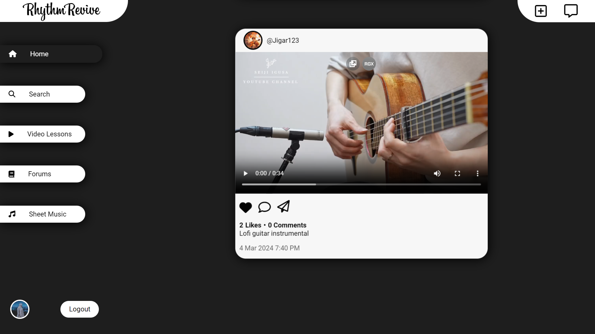

# RhythmRevive - Social Media Made For Music Enthusiasts

## Installation and Usage

1. Clone the repository: `git clone https://github.com/x0tic0p/rhythmrevive-socialmedia`
2. Set up your local web server environment (e.g., XAMPP, WAMP, MAMP).
3. Create a MySQL database and import the provided SQL schema from sql-files directory.
4. Configure the database connection in `sqlconnect.py`.
5. Install required Python modules: `pip install -r requirements.txt`
6. Open the project directory and open terminal and type `python app.py`
7. Start your local server and access the project in your browser.

For more detailed installation instructions, please refer to the [Installation Guide](installation.md).

## ScreenShots

- ### Login Screen

- ### OTP Verification Mail

- ### Home Feed (Desktop)

- ### Home Feed (Mobile)

- ### Live User Search

- ### Live Messaging Via SocketIO

- ### Admin Creation

- ### Admin User Moderation (Ban & Unban)

## Technologies Used

- HTML, CSS, JavaScript for frontend development.
- Flask (Python) and MySQL for backend server and database management.
- AJAX for real-time communication and notifications.

## Contributors

- [Ayush Joshi](https://github.com/Ayushx309)

## Contributing

- Fork the repository.
- Create a new branch for your changes: `git checkout -b feature/my-new-feature`
- Commit your changes: `git commit -am 'Add some feature'`
- Push to the branch: `git push origin feature/my-new-feature`
- Create a new Pull Request.

## Communication

If you need support for the Project &  want to chat with other devs join the [PAIN's HUB](https://discord.gg/painshub) Discord server or send me a friend request at `paiiinn` on discord

## License

This project is licensed under the [GNU General Public License](LICENSE), version 3
